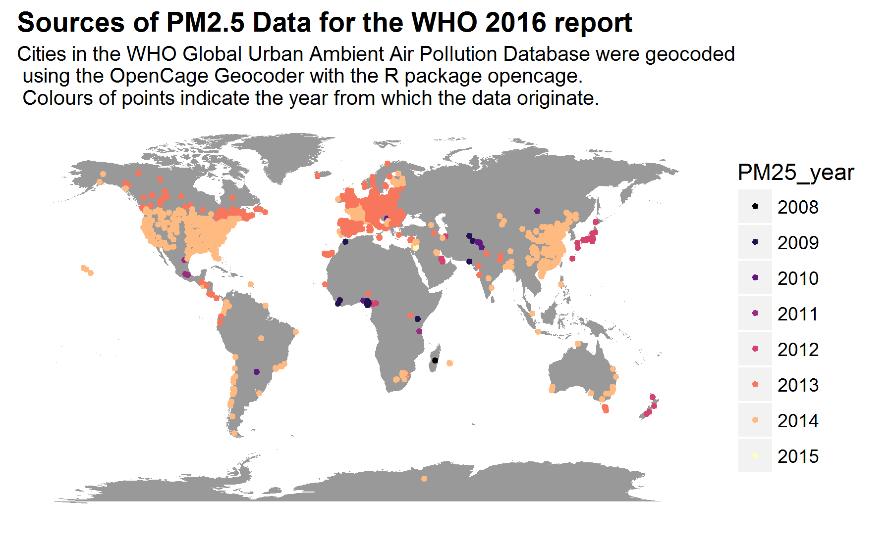

A Look at the Update 2016 of the WHO Global Urban Ambient Air Pollution Database
================================================================================

Introduction
============

The WHO has recently published an update of its database about PM2.5 and PM10 ambient average annual concentrations in many cities of the world. The database can be found [on this website](http://www.who.int/phe/health_topics/outdoorair/databases/cities/en/) along with documentation and analyses.

The database has at least two limitations (although it is a very good compilation of data!):

-   Not all countries are represented, since some of them do not monitor these pollutants or do not make the data available.

-   Because of the delay in countries publishing their air pollution figures, or because the last available figures are from an external study (for instance an occupational health work about Swedish soldiers for one city in Afghanistan), the year from which the data originate is often not 2015 or even not 2014. This was noted for instance in [this article of The Hindu](http://www.thehindu.com/news/cities/Delhi/outdated-data-misleading-experts/article8598361.ece?utm_source=RSS_Feed&utm_medium=RSS&utm_campaign=RSS_Syndication&utm_source=twitterfeed&utm_medium=twitter), and [this blog post of OpenAQ](https://medium.com/@openaq/surprising-make-up-of-yearly-air-quality-data-from-most-recent-who-report-61ae780df2ce#.8f4n8g6fd).

I decided to make a map showing that

1.  The sources are less numerous in some parts of the world

2.  The age of the data is different according to country.

For this, I had to geocode all cities in the database, which I did using the [opencage R package](https://github.com/ropenscilabs/opencage) (it's on [CRAN](https://cran.r-project.org/web/packages/opencage/index.html) too) for the [OpenCage Geocoder](https://geocoder.opencagedata.com/)

Geocoding with OpenCage Geocoder in R
=====================================

In the file [data\_prep1.R](data_prep1.R) I transformed the 3-letter ISO code of the country in the two-letter ISO code using the R package [countrycode](https://cran.r-project.org/web/packages/countrycode/index.html), and then I used the `opencage_forward` function with the city as `placename` and the country code as `country`. When the results had more than one line I took the first one, since at this scale I do not care whether I get the city itself or its airport. Out of 2973 cities, only 7 could not be geolocated this way so I added their coordinates per hand in [data\_prep2.R](data_prep2.R). For instance I could not find "Nabih Saleh" in Bahrain as such, but searching for "Saleh" I could locate it, or on [this website](http://nelson.govt.nz/environment/air-quality/air-monitoring/airsheds-in-nelson/) I could understand that "Nelson Airshed A" was in Nelson.

Maybe I could have used the ID.WHO.city for geolocation instead but I realized this afterwards and I do not know what this ID is.

Data selection for the maps
===========================

The database compiles information about PM2.5 and PM10. In some cases the concentration given for PM2.5 is not measured but converted from the PM10 concentration and vice versa. Therefore for the PM25 map I for instance chose only the *measured data*.

Year of the data
================

Interestingly the year was not always an integer, for Delhi in India it is "2013.2". Therefore I rounded years with the `floor` function.

Maps!
=====

Take-home messages:

-   Some countries seem to rather monitor PM10.

-   There is a big lack of data in many countries, in particular in low income countries.

-   The data can be quite old in some cases. This is why [OpenAQ](https://openaq.org/) efforts for building the first world-wide open air quality data hub are so awesome! Have a look at their data, e.g. with the [R package ropenaq](https://github.com/ropenscilabs/ropenaq).

Use the data!
=============

The data is saved as [RData](who_aq_data2.RData) and [csv](WHO_AQ_data_geocoded.csv). Feel free to use it while stating it's WHO data, and tell me if you have ideas of how to use them, I'd be glad to see your work!
